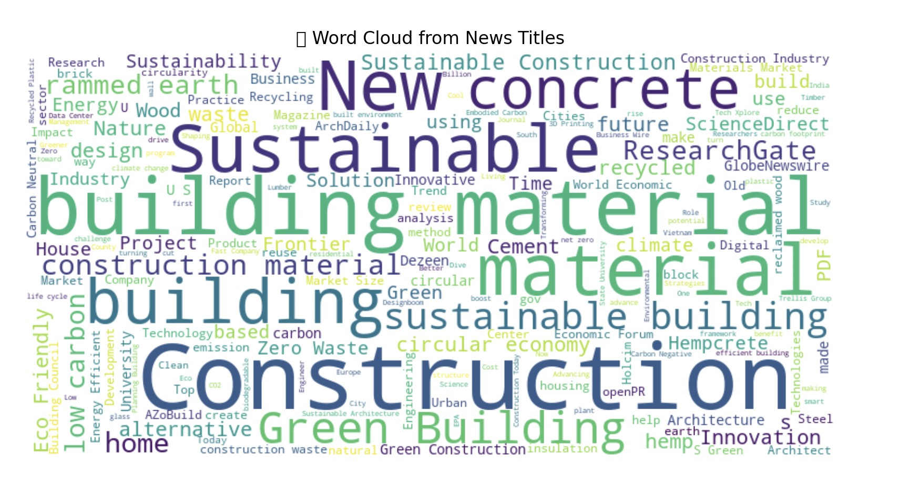

# dsi321_2025

This project is a web scraper built using Python. It fetches news search results related to sustainable and alternative construction materials from Google News RSS (via `feedparser`) and stores them in a CSV file for further analysis.

---
# File Structure
    ```bash
    .
    ├── README.md
    ├── data
    │   └── testv1_scraped.csv
    ├── requirements.txt
    └── src
        ├── __pycache__
        │   └── generate_wordcloud.cpython-313.pyc
        ├── check_duplicates.py
        ├── generate_wordcloud.py
        ├── minmax_publish.py
        └── testv1_scraper.py
    └── venv
    └── image
        └── wordcloud.jpg
    ```
#  Requirements

Make sure you have Python 3.7+ installed, then install the following packages:

- `feedparser`
- `pandas`
- `requests`
- `beautifulsoup4`
- `selenium`
- `webdriver-manager`
- `feedparser`
- `wordcloud `
- `matplotlib`


Install them via:

    pip install -r requirements.txt

# Usage

1. Clone the repository:
    ```bash
    git clone https://github.com/yourusername/dsi321_2025.git
    cd dsi321_2025
    ```

2. Create a virtual environment and activate it:
    ```bash
    python3 -m venv venv
    source venv/bin/activate
    ```

3. Run for scraping
    ```bash
    python src/testv1_craper.py
    ```


# First Run

4. The script will fetch news articles based on these keywords:
    ```bash
     search_keywords = [
    "sustainable construction materials",
    "eco friendly building materials",
    "alternative construction methods",
    "green building materials"
    ]

5. All results will be automatically saved to:
    ```bash
    data/testv1_scraped.csv

The script ensures there are no duplicate links, even when running multiple times.

6. Check for Duplicates
    To verify if there are any duplicate news entries (based on both title and link), you can run:
    ```bash
    python src/check_duplicates.py


# This script will read from:

    data/testv1_scraped.csv

and show how many duplicates exist, if any.

The check is based on (title, link) pairs.
It helps ensure your dataset is clean and ready for further analysis or visualization.

# Second Run

7. Add the script will fetch news articles based on these keywords:
    ```bash

     search_keywords = [
    "sustainable construction materials",
    "eco friendly building materials",
    "alternative construction methods",
    "green building materials",
    "recycled construction materials",
    "low carbon construction materials",
    "biodegradable construction materials",
    "natural building materials",
    "energy efficient building materials",
    ]

# Third Run

8. Add the script will fetch news articles based on these keywords:
    ```bash

    search_keywords = [
    "sustainable construction materials",
    "eco friendly building materials",
    "alternative construction methods",
    "green building materials",
    "recycled construction materials",
    "low carbon construction materials",
    "biodegradable construction materials",
    "natural building materials",
    "energy efficient building materials",
    "renewable construction resources",
    "zero waste construction materials",
    "earth friendly construction",
    "carbon neutral building materials",
    "hempcrete construction",
    "rammed earth construction",
    "reclaimed wood building materials",
    "innovative sustainable construction",
    "circular economy construction materials",
    "sustainable architecture materials"
    ]

# How to run for create WORDCLOUD   

9. ```bash
    python src/generate_wordcloud.py
    ```

###  Word Cloud from News title




# Output

The output 

1. CSV file includes the following columns:

   - title: News title
   - link: Direct URL to the news
   - published: Published date
   - fetched_at: The timestamp the data was fetched
   - keyword: The search keyword that matched the article

2. Wordcloud form `src/generate_wordcloud.py`

